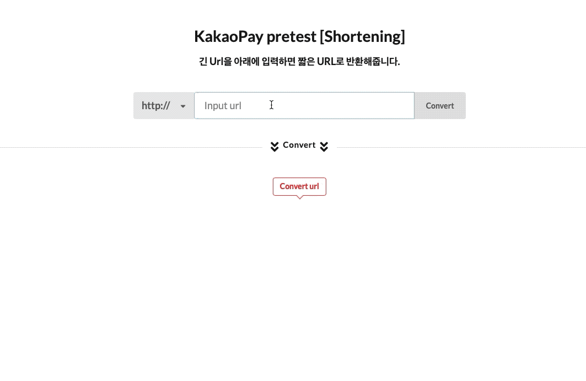
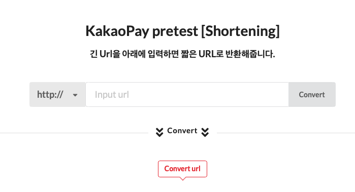
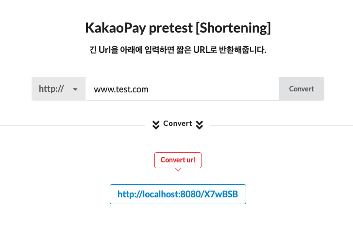
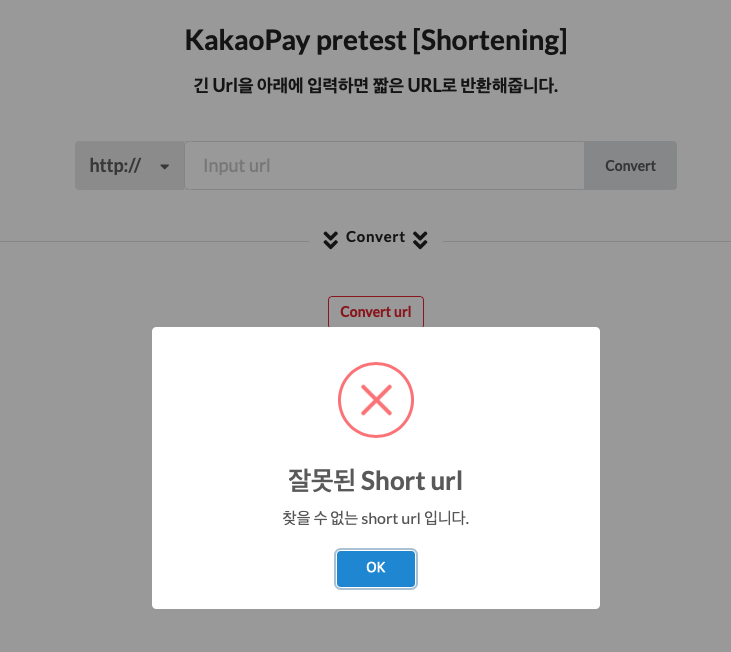

# URLShortening

> 2019 카카오페이 사전과제
* URL을 전달하면 단축 URL을 제공하는 웹 서비스
* Example
    * https://en.wikipedia.org/wiki/URL_shortening => http://localhost/JZfOQNro

---

## 프로젝트 구성

### 개발환경
* Mac OS X
* IntelliJ

### 사용 기술
* Back-End
    * Java8
    * Spring Boot 2.2.2
    * JPA
    * Lombok
    * Thymeleaf
    * jUnit
* Front-End
    * Semantic-UI
    * jQuery
* Database
    * H2

### 프로젝트 구현 방법
* Java8과 Spring boot를 활용하여 프로젝트 구현.
* 화면의 경우 Thymeleaf와 Semantic-UI, Ajax를 통해 구현.
* 테스트 코드의 경우 코드 자체 기능이 간단하여 Short url 구현하는 서비스 코드에 대한 테스트 로직만 작성.

---

## 진행 시 문제점(고민) 및 해결 방안

1. Short URL을 만들 때 고유 값 생성
    * 짧을 URL Key의 생성 조건은 아래와 같다.
        * Key는 중복이 불가능하다. (원본 URL과 1:1 관계)
        * 동일한 원본 URL을 변환 시 항상 동일한 단축 URL Key가 생성되어야 한다.
        * Short url은 8글자 미만이어야 한다.
    * 해결
        * 먼저 키 중복을 막기 위해서는 고유한 값을 만들어야 했다.
        * 키 중복을 막기 위해서는 UUID, 시간 등의 요소를 생각할 수 있었지만, 두 번째 조건에 위배가 된다.
        * 그래서 이를 위해 생각한 것은 **Adler32 CheckSum 알고리즘**과 **62진법**을 이용하여 구현하기로 하였다.
        * **Adler32 CheckSum 알고리즘**을 이용해서 특정 값에 대한 동일한 고유 값을 보장받을 수 있었고, **62진법**의 경우 알파벳 + 숫자 갯수이며 이를 통해서 URL에 필요한 값을 뽑을 수 있었다. 
        
2. Short URL 구현 방법
    * 사용자가 URL을 전달하면 Adler32로 CheckSum 값(Long)을 만들어준다.
    * 해당 CheckSum 값을 통해 Base62로 인코딩을 해준다.
    * 인코딩을 해주면 Short url 키가 만들어진다.
    * 예를들어 원본 URL은 http://www.test.com 인 경우, 이 값을 **Adler32**를 통해서 CheckSum 값(1182533401)을 뽑는다.
    * 다음 [Base62Helper](https://github.com/elfinlas/URLShortening/blob/master/src/main/java/com/kakaopay/shortening/common/utils/Base62Helper.java) 클래스를 통해 인코딩을 진행해주면 인코딩 (X7wBSB) 된 값을 얻을 수 있다.
    * 그래서 결론적으로는 **http://localhost:8080/X7wBSB** 라는 단축 URL이 완성된다. 

3. localhost/{shortKey}를 전달 시 메인 URL과 함께 겹치는 문제점
    * favicon 이미지 등 정적 리소스를 메인 URL에서 찾을 때 Short url을 호출하는 포인트와 동일하여 [커스텀 예외](https://github.com/elfinlas/URLShortening/blob/master/src/main/java/com/kakaopay/shortening/shorturl/exceptions/ShortKeyNotFoundException.java)가 발생한다.
    * 이를 막기 위해서 해당 컨트롤러를 처리하는 메서드에서 특수문자가 들어간 값이 온 경우 메인 페이지, 그 외에는 Short url로 리다이렉션 처리 하는 방식으로 구현하였다. 

4. Short url history
    * 만들어진 Short url의 경우 재 사용성 및 Short url의 확인 처리를 위해서 DB를 사용하였다.
    * 해당 프로젝트에서는 내장 H2를 사용하여 구현하였다.

---    

## 프로젝트 구동 방법

### 구동방법

* Terminal
    * gradle build 
    * java -jar build/libs/shortening-0.0.1.jar
* IntelliJ
    * gradle sync (동기화)
    * ShorteningApplication (Run Server)
    
### 동작 방법

1. 서버가 구동되면 http://localhost:8080으로 접근한다.

2. http:// 또는 https:// 를 선택해주고, 변환할 url을 입력해준다.
3. 입력 후 convert 버튼을 클릭하면, 하단에 변환된 값이 표시된다.

4. 변환된 값을 브라우저에 확인해보면 정상적으로 표시되는 것을 확인할 수 있다.
5. 만약 미 등록된 Short url을 전달할 경우 에러 알림이 표시된다.

